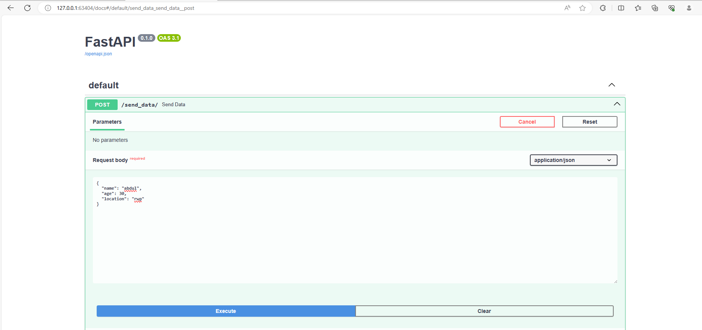

**devops_assignment4**

**Building my custom docker image:** 

docker build -t abdul7235/hello-app .

**Pushing it to dockerhub:**

docker push abdul7235/hello-app

**Deploying Applications:**

Three deployments made

kubectl apply -f mongodb-configmap.yaml

kubectl apply -f mongodb-secret.yaml

kubectl apply -f mongodb-deployment.yaml

kubectl apply -f hello-deployment-1.yaml

kubectl apply -f hello-deployment-2.yaml

kubectl apply -f hello-deployment-3.yaml

kubectl get all

**Setting Up Services:**

Services also setup with commands in previous part since deployments and services written in same yaml file

**Accessibility Demonstration:**

minikube service hello-app-loadbalancer

**200 Response and data pushed to MongoDB:**

minikube service hello-app-nodeport

**200 Response and data pushed to MongoDB:**

**Checking data in Mongodb:**

kubectl port-forward mongodb-deployment-84d7c8b6dd-wbgrf 27017:27017

minikube service hello-app-clusterip

Strangly I can access ClusterIP service on my local machine, which is possibly due to Minikube setting up a tunnel that allows me to access the ClusterIP service from my local machine

**200 Response and data pushed to MongoDB:**

**Get this Error when setting the nodeport in ClusterIP service:**

This error proves that ClusterIP service cannot be exposed outside of clusters to be accessed from external

The Service "hello-app-clusterip" is invalid: spec.ports[0].nodePort: Forbidden: may not be used when `type` is 'ClusterIP'